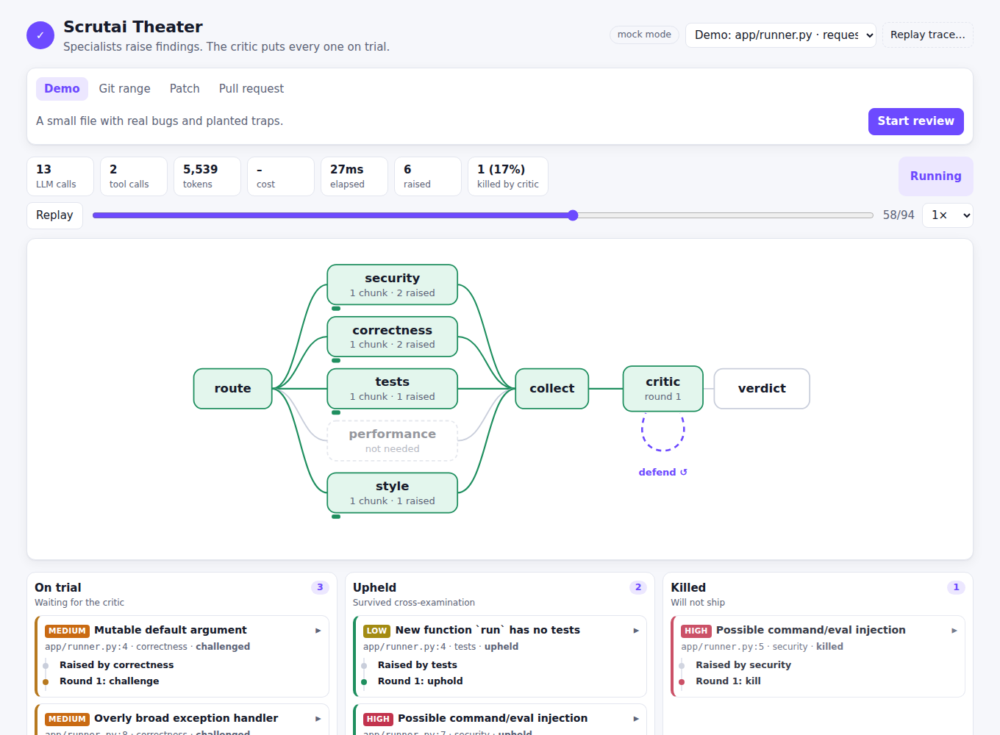
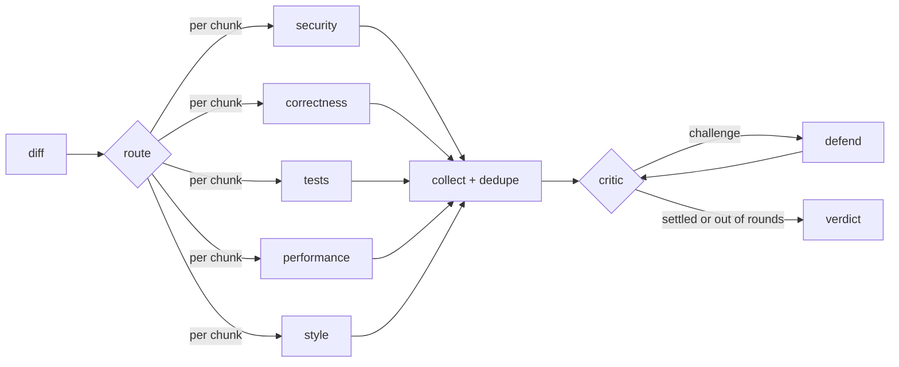

<div align="center">

# Scrutai

**A panel of AI specialists reviews your code. An adversarial critic kills the false positives.**<br>
*Every finding survives scrutiny, or it doesn't ship.*

[](https://github.com/imkarthiknr/Scrutai/actions/workflows/ci.yml)


[Quickstart](#quickstart) ·
[How it works](#how-it-works) ·
[GitHub Action](#use-it-on-every-pull-request) ·
[Agent theater](#watch-it-think-the-agent-theater) ·
[MCP server](docs/MCP.md) ·
[Configuration](#configuration-reference) ·
[Benchmark](#benchmark) ·
[Contributing](DEVELOPMENT.md) ·
[Releases](RELEASES.md)



</div>

---

## Table of contents

- [Why Scrutai](#why-scrutai)
- [Features](#features)
- [Quickstart](#quickstart)
- [Installation](#installation)
- [Usage](#usage)
  - [Review a branch, a patch or a PR](#review-a-branch-a-patch-or-a-pr)
  - [Use it on every pull request](#use-it-on-every-pull-request)
  - [Watch it think: the agent theater](#watch-it-think-the-agent-theater)
  - [Ask for it from your AI assistant: the MCP server](#ask-for-it-from-your-ai-assistant-the-mcp-server)
  - [Measure it: the benchmark](#measure-it-the-benchmark)
  - [Use it as a library](#use-it-as-a-library)
- [Running with a real model](#running-with-a-real-model)
- [How it works](#how-it-works)
- [Configuration reference](#configuration-reference)
- [Benchmark](#benchmark)
- [Security and privacy](#security-and-privacy)
- [Project layout](#project-layout)
- [FAQ](#faq)
- [Roadmap](#roadmap)
- [Contributing](#contributing)
- [License](#license)

---

## Why Scrutai

Most AI code reviewers make a single pass: `diff → model → comments`. They are fast, and they
are noisy. A reviewer that raises thirty plausible-sounding issues, three of them real, trains
people to ignore it, and then it catches nothing.

Scrutai is built around one rule: **every finding survives scrutiny, or it doesn't ship.**

1. **A panel of specialists** reviews the change: security, correctness, tests, performance and
   style. Each one wakes only when the change touches its area.
2. **They are grounded in the real repository.** Each specialist is a ReAct agent that reads files,
   searches the codebase, checks `git blame` and runs Semgrep before it makes a claim.
3. **An adversarial critic puts every finding on trial.** It checks the claim against the cited
   code and decides to *uphold*, *downgrade*, *kill* or *challenge* it. A challenged finding goes back
   to its specialist, who must defend it with fresh evidence or withdraw it.
4. **You get what survived:** a short list of real issues, each with its exact file and line, the
   evidence, and the critic's reasoning. Everything that was killed is still available, with the
   reason, if you want to audit the critic.

And because a reviewer you can't measure is a reviewer you can't trust, Scrutai ships with a
**benchmark harness** that reports precision and recall *with and without the critic*, so the
critic has to earn its tokens.

## Features

| | |
|---|---|
| 🧑‍⚖️ **Adversarial critic** | Four decisions (uphold / downgrade / kill / challenge) and a bounded debate in which specialists defend or withdraw. Findings the critic could not judge are withheld, never shipped. |
| 🔎 **Grounded specialists** | Five ReAct agents with sandboxed tools: `read_file`, `grep`, `git_blame`, `semgrep`. |
| 🧭 **Smart routing** | A docs-only change wakes nobody; security only wakes on risky code or sensitive paths. Optional LLM router that can only *narrow* the selection. |
| 🛡️ **Semgrep built in** | Runs when installed; a bundled offline ruleset needs no network. A rule firing on the exact line is the strongest evidence a finding can carry. |
| 🐙 **GitHub Action** | One summary comment edited in place, plus inline comments that are never re-posted across pushes. SARIF output for GitHub code scanning. |
| 🤖 **MCP server** | `scrutai mcp` gives Claude Code, Claude Desktop, Cursor and other MCP clients review, explain and benchmark tools, over stdio or authenticated HTTP. It posts to a PR only after the user confirms. |
| 🎭 **Agent theater** | A React UI that shows a review live (or replays a recording): the agent graph, and a trial board following each finding from raised to upheld or killed. |
| 📏 **Benchmark harness** | 50 labelled cases including deliberate traps; precision, recall, clean-diff false-positive rate and the critic's lift; usable as a CI gate. |
| 💸 **Cost guardrails** | Per-review token and dollar caps; partial reviews are flagged, and nothing unjudged ships. |
| ⚡ **Built for big diffs** | Diffs are chunked (~250 added lines), each chunk is routed on its own, and agents run concurrently. |
| 🔭 **Observability** | JSONL traces of every node, LLM call, tool call and critic decision; OpenTelemetry and Langfuse exporters. |
| 🔌 **Framework-agnostic** | One seam (`Specialist._loop`); a CrewAI backend ships today, with identical results on the benchmark. |
| 🌐 **Any model** | Anything [LiteLLM](https://docs.litellm.ai) supports. Defaults to Claude; runs fully offline in mock mode. |

## Quickstart

No API key needed. Scrutai runs in **mock mode** by default: the whole pipeline executes offline
against a deterministic stand-in model, so you can see every moving part before spending anything.

```bash
git clone https://github.com/imkarthiknr/Scrutai.git
cd Scrutai
pip install -e ".[web]"

scrutai review --demo --show-dropped   # a sample file with real bugs and planted traps
scrutai serve                          # the agent theater at http://127.0.0.1:8765
scrutai eval                           # the benchmark: precision, recall, critic lift
```

Expected output of the demo (abridged):

```text
Verdict: request_changes   agents=security,correctness,tests,style rounds=2 tokens=9152 cost=$0.0000
5 issue(s) upheld. Most severe: Possible command/eval injection (high).

 Severity  Agent        Conf  File:Line         Finding
 high      security     0.85  app/runner.py:7   Possible command/eval injection
 medium    correctness  0.85  app/runner.py:4   Mutable default argument
 medium    correctness  0.85  app/runner.py:8   Overly broad exception handler
 low       tests        0.85  app/runner.py:4   New function `run` has no tests
 low       style        0.85  app/runner.py:9   Debug leftover

                         Dropped by the critic
 security  app/runner.py:5  Possible command/eval injection  Pattern only appears in a comment or string literal.
```

## Installation

**Requirements:** Python 3.12+, `git`. Optional: [ripgrep](https://github.com/BurntSushi/ripgrep)
(faster search; Scrutai falls back to `git grep` or pure Python), [Semgrep](https://semgrep.dev)
(SAST evidence). Node.js is only needed to *develop* the web UI, not to run it.

Scrutai is not on PyPI yet. Install it from GitHub:

```bash
# Core: CLI, agents, critic, benchmark, GitHub integration
pip install "scrutai @ git+https://github.com/imkarthiknr/Scrutai.git"

# With extras (combine as needed)
pip install "scrutai[web,semgrep] @ git+https://github.com/imkarthiknr/Scrutai.git"
```

| Extra | Adds | Install when you want |
|---|---|---|
| `web` | FastAPI, Uvicorn | the agent theater (`scrutai serve`) |
| `semgrep` | Semgrep | SAST evidence for the security agent |
| `mcp` | MCP Python SDK | the MCP server (`scrutai mcp`) |
| `crewai` | CrewAI | the CrewAI framework backend |
| `otel` | OpenTelemetry API + SDK | `tracing: otel` |
| `langfuse` | Langfuse | `tracing: langfuse` |
| `dev` | test, lint and type-check tooling | to contribute (see [DEVELOPMENT.md](DEVELOPMENT.md)) |

## Usage

Scrutai has four commands: `review`, `serve`, `mcp` and `eval`. Run any of them with `--help`.

### Review a branch, a patch or a PR

```bash
scrutai review --base main                  # your branch vs main (merge-base, like a PR)
scrutai review --base v1.2 --head feature   # any two refs
scrutai review --diff change.patch          # a unified diff file
git diff | scrutai review --diff -          # ...or stdin
scrutai review --pr 128                     # a GitHub PR (needs GITHUB_TOKEN)
scrutai review --pr 128 --post              # ...and post the review on it
scrutai review --demo                       # the bundled sample
```

| Option | What it does |
|---|---|
| `--base`, `--head` | Git refs to compare (default `main` and `HEAD`). |
| `--repo` | Repository root (default `.`). |
| `--diff FILE` | Review a unified diff file; `-` reads stdin. |
| `--pr N`, `--post`, `--github-repo` | Review a GitHub pull request; optionally post the review. |
| `-f, --format` | `table` (default), `json`, `markdown` or `sarif`. `--json` is a shorthand. |
| `-o, --output FILE` | Write the report to a file. |
| `--show-dropped` | Also list the findings the critic killed, and why. |
| `--trace FILE` | Write a JSONL trace of every step (replayable in the theater). |
| `--config FILE` | Config file (default `.scrutai.yml`; every key is optional). |

**Exit codes** make it CI-friendly: `0` no blocking finding · `1` a finding at or above
`fail_on` (default `high`) · `2` usage, diff or API error.

**Output formats:**

- `table`: a human-readable summary in the terminal.
- `json`: the full `ReviewResult`, including dropped findings and the critic's history for each.
- `markdown`: what the GitHub Action posts.
- `sarif`: SARIF 2.1.0 for GitHub code scanning and other SAST dashboards, with stable fingerprints.

### Use it on every pull request

Add `.github/workflows/scrutai.yml` to the repository you want reviewed:

```yaml
name: scrutai
on: pull_request

permissions:
  contents: read
  pull-requests: write     # summary + inline comments
  security-events: write   # SARIF upload (optional)

jobs:
  review:
    runs-on: ubuntu-latest
    steps:
      - uses: actions/checkout@v4
        with:
          ref: ${{ github.event.pull_request.head.sha }}   # tools read the PR's code
      - uses: imkarthiknr/Scrutai@main
        with:
          llm-mode: live
          install-semgrep: "true"
          sarif-file: scrutai.sarif
        env:
          ANTHROPIC_API_KEY: ${{ secrets.ANTHROPIC_API_KEY }}   # or any LiteLLM provider key
      - uses: github/codeql-action/upload-sarif@v3
        if: always() && hashFiles('scrutai.sarif') != ''
        with:
          sarif_file: scrutai.sarif
```

**What the Action does on the PR:**

- **One summary comment**, found again by a hidden marker and **edited in place** on every push,
  so it never piles up.
- **One inline comment per finding**, on the exact added line. Each carries a fingerprint that
  ignores line numbers, so a finding that survives a push is **never posted twice**, even if
  the code around it moved.
- The full report in the **job summary**, and the `verdict` as a step output.

| Input | Default | Description |
|---|---|---|
| `config` | `.scrutai.yml` | Path to the config file in the repository. |
| `llm-mode` | *(from config)* | `mock` or `live`. |
| `post-comments` | `true` | Post the summary and inline comments. |
| `sarif-file` | *(none)* | Also write SARIF to this path. |
| `install-semgrep` | `false` | Install Semgrep for SAST evidence. |
| `fail-on-findings` | `true` | Fail the job on a finding at or above `fail_on`. |
| `python-version` | `3.12` | Python used to run Scrutai. |

| Output | Description |
|---|---|
| `verdict` | `approve`, `comment` or `request_changes`. |

### Watch it think: the agent theater

```bash
pip install -e ".[web]"
scrutai serve                       # http://127.0.0.1:8765
scrutai serve --replay run.jsonl    # open a recorded trace (from review --trace)
```

Start a review from the browser (demo, git range, pasted patch or PR number) and watch it happen:

- **The review graph:** the router picks specialists, each agent lights up per diff chunk, and the
  critic loops through rounds with the `defend` step.
- **The trial board:** every finding moves from **On trial** to **Upheld** or **Killed**, with its
  story: who raised it, the critic's challenge, the specialist's defense or withdrawal, and the
  ruling with its reason.
- **Live stats:** LLM and tool calls, tokens, cost, elapsed time and the critic's kill rate.
- **Playback:** replay any finished run at 1×, 4× or 16×, or scrub event by event. Upload any
  `--trace` file and it plays back exactly like a live run.

The server binds to `127.0.0.1` by default because it can read your repository and spend your API
budget. The built UI ships inside the Python package; Node is only needed to work on the UI.

### Ask for it from your AI assistant: the MCP server

```bash
pip install -e ".[mcp]"
claude mcp add scrutai -- scrutai mcp --root "$PWD"     # Claude Code, local (stdio)

# Remote, over Streamable HTTP with a bearer token:
SCRUTAI_MCP_TOKEN=... scrutai mcp --transport http --port 8000 --root ~/src
```

Then ask your assistant to *"review my branch against main with Scrutai"*. Your MCP client gets
these tools:

- **Review:** `review_git_range`, `review_patch` and `review_pull_request`.
- **Results:** `get_review`, `list_reviews` and `explain_finding`. `explain_finding` returns the
  critic's challenge, the specialist's defense and the code around the line.
- **Posting:** `post_review` writes to the PR only after the user confirms, and is off with
  `--no-post`.
- **Benchmark:** `run_benchmark`.

Every tool returns structured results. The server also provides:

- **Resources:** the Markdown report, SARIF and trace of every review.
- **Prompts:** `review-my-branch`, `fix-finding` and `security-audit`.

Reviews report progress and can be cancelled. Repository paths are confined to `--root`. HTTP
binds to localhost unless a token is set. See **[docs/MCP.md](docs/MCP.md)** for client configs,
every tool's schema and the security model.

### Measure it: the benchmark

```bash
scrutai eval                                   # metrics + a per-category table
scrutai eval --min-precision 0.95 --min-recall 0.8   # as a CI gate (exit 1 below the bar)
scrutai eval --report eval.md --json           # markdown report + JSON metrics
scrutai eval --compare crewai                  # same benchmark, native vs CrewAI agents
scrutai eval --benchmark my-cases.jsonl        # your own labelled cases
```

Each case is one JSON line with the patch, the expected finding categories, and optionally other
files of the repository it lives in:

```json
{"id": "inj-01", "file": "runner.py", "patch": "+def run(cmd):\n+    return os.system(cmd)\n",
 "labels": ["injection"], "repo": {"tests/test_runner.py": "..."}, "note": "why this case exists"}
```

An empty `labels` list marks a clean change, where any finding is a false positive. Every case runs
in its own temporary repository, so results never depend on where you run `eval`.

### Use it as a library

The CLI, the Action, the server and the benchmark all call one function:

```python
from scrutai import review_diff
from scrutai.config import ScrutaiConfig
from scrutai.diff import apply_filters, diff_from_git
from scrutai.llm import make_client

config = ScrutaiConfig.load(".scrutai.yml")
diff = apply_filters(diff_from_git("main", "HEAD"), config.include, config.exclude)
result = review_diff(diff, config, make_client(config.llm_mode))

print(result.verdict, result.summary)
for f in result.findings:
    print(f"{f.severity:>8}  {f.file}:{f.line}  {f.title}  ({f.critic_note})")
```

`ReviewResult` is a Pydantic model: `verdict`, `findings`, `dropped`, `summary`, `tokens_used`,
`cost_usd`, `rounds`, `agents`, `budget_exhausted`, `cancelled`.

## Running with a real model

Switch `llm_mode` to `live` and provide a key for any provider
[LiteLLM supports](https://docs.litellm.ai/docs/providers):

```yaml
# .scrutai.yml
llm_mode: live
models:
  router: anthropic/claude-haiku-4-5       # cheap: picks which specialists run
  specialist: anthropic/claude-sonnet-5-5  # the five reviewers
  critic: anthropic/claude-opus-5-5        # strongest: its judgement is the product
```

```bash
export ANTHROPIC_API_KEY=...
scrutai review --base main
```

Any LiteLLM model string works (OpenAI, Gemini, Bedrock, Vertex, local models, and so on), and each
role can use a different provider.

**Keeping costs under control:**

- `token_budget` (default 200,000 tokens per review) and `max_cost_usd` are hard caps. When one is
  reached, Scrutai stops calling the model, marks the review **partial**, and withholds anything
  the critic had not judged.
- Routing skips specialists a change can't need, and chunking keeps prompts small.
- Every result reports `tokens_used` and `cost_usd`; `--trace` breaks both down per call.

## How it works



1. **Parse and filter.** The diff is parsed with real new-file line numbers. `include` and `exclude`
   globs apply, and deleted or binary files are dropped.
2. **Chunk and route.** Added lines are packed into chunks of about `chunk_lines`. Each chunk is
   routed on its own: docs, lockfiles and assets wake nobody; security wakes on a risk surface
   (exec, SQL, secrets, crypto, deserialization, HTTP...) or a sensitive path; tests wakes only
   when new functions appear.
3. **Specialists investigate**, concurrently, one branch per agent and chunk (LangGraph `Send`).
   Each runs a bounded ReAct loop over its tools and returns typed findings: file, line, category,
   severity, confidence and evidence.
4. **Collect.** Findings are merged and deduplicated: the same category on the same line is one
   issue.
5. **The critic cross-examines** every finding against the cited line *and its surroundings*:

   | Decision | Meaning |
   |---|---|
   | **uphold** | Real and backed by evidence; the critic sets the confidence. |
   | **downgrade** | Real but over-rated; severity can only go down. |
   | **kill** | Not in this diff, only in a comment or string, a placeholder, a constant input... |
   | **challenge** | Plausible but under-evidenced; the specialist must defend it or withdraw. |

6. **Debate.** Challenged findings go back to their specialist, which may gather new tool evidence.
   The critic re-judges only those. `max_critic_rounds` bounds the loop.
7. **Verdict.** Survivors above `min_confidence` and `min_severity` become the result.
   `request_changes` at or above `fail_on`, otherwise `comment`, or `approve` if nothing survived.

**The specialists and what they look for:**

| Agent | Categories | Tools |
|---|---|---|
| `security` | injection, sql_injection, hardcoded_secret, unsafe_deserialization, weak_crypto, tls_verify_disabled, path_traversal | read_file, grep, git_blame, semgrep |
| `correctness` | broad_except, mutable_default, none_comparison, identity_literal, logic_error | read_file, grep, git_blame |
| `tests` | missing_tests | grep, read_file |
| `performance` | n_plus_one, regex_in_loop, string_concat_in_loop, sort_for_min_max | read_file, grep, git_blame |
| `style` | debug_leftover, wildcard_import, untracked_todo | read_file, grep |

The full design rationale (why hierarchical delegation, why grounded tools, why a debate, why a
budget, what the mock model does and doesn't prove) is in
[docs/ARCHITECTURE.md](docs/ARCHITECTURE.md).

## Configuration reference

Everything lives in `.scrutai.yml`. Every key is optional; these are the defaults. Unknown agents,
modes or backends are rejected with a clear error (exit code `2`).

| Key | Default | Description |
|---|---|---|
| `enabled_agents` | all five | Which specialists may run. |
| `min_severity` | `low` | Drop findings below this (`info` < `low` < `medium` < `high` < `critical`). |
| `min_confidence` | `0.6` | The critic's bar: findings below it don't survive. |
| `fail_on` | `high` | Severity at which `review` exits `1` and the verdict is `request_changes`. |
| `llm_mode` | `mock` | `mock` (offline, deterministic) or `live`. |
| `models.router` | `anthropic/claude-haiku-4-5` | Model used by the optional LLM router. |
| `models.specialist` | `anthropic/claude-sonnet-5-5` | Model for the five specialists. |
| `models.critic` | `anthropic/claude-opus-5-5` | Model for the critic. |
| `routing` | `heuristic` | `heuristic`, or `llm` (the router model may narrow the selection, never widen it). |
| `max_agent_steps` | `4` | ReAct budget per specialist: tool calls plus the final answer. |
| `max_critic_rounds` | `2` | Debate rounds; `1` disables the debate. |
| `chunk_lines` | `250` | Added lines per chunk; `0` reviews the whole diff at once. |
| `concurrency` | `4` | Parallel critic and defense calls. |
| `token_budget` | `200000` | Hard token cap per review; `0` disables. |
| `max_cost_usd` | `0.0` | Hard dollar cap per review (live mode); `0` disables. |
| `semgrep` | `auto` | `auto` (if installed), `off`, or `required` (fail if missing). |
| `semgrep_config` | `bundled` | The offline ruleset, or any `semgrep --config` value (e.g. `p/default`). |
| `backends` | `{}` | Agent framework per specialist, e.g. `{security: crewai}` or `{"*": crewai}`. |
| `tracing` | `none` | `none`, `otel` or `langfuse` (`--trace FILE` works regardless). |
| `include` | `["**/*"]` | Globs of files to review. |
| `exclude` | vendor, lockfiles, dist | Globs of files to skip. |

## Benchmark

`scrutai eval` on the bundled 50-case benchmark (`benchmark/cases.jsonl`). Of the 50 cases, 22 are
clean changes, many of them deliberate traps: sinks in comments and strings, constant commands,
placeholder secrets, `yaml.safe_load`, bound SQL parameters, tests that already exist.

| Metric | With critic | Specialists only |
|---|---|---|
| Precision | **1.00** | 0.77 |
| Recall | **0.90** | 0.90 |
| False positives | **0** | 8 |
| Clean diffs flagged | **0%** | 36% |

| Framework comparison (`--compare crewai`) | native | crewai |
|---|---|---|
| Precision / recall | 1.00 / 0.90 | 1.00 / 0.90 |
| Per-case agreement | | **100%** |
| Wall time (mock model) | 0.6 s | 31.8 s |

> **Read these numbers honestly.** They come from **mock mode**: a deterministic, rule-based
> stand-in that is deliberately noisy so the critic has something to remove. They prove the
> *machinery* works: routing, the debate, deduplication and scoring are wired correctly, and the
> critic removes noise **without costing recall**. They are **not** a claim about any LLM. To
> measure a real model, run `scrutai eval` with `llm_mode: live`. The three misses are cases
> labelled as expected misses (data-flow SQL injection, path traversal, an off-by-one), kept so the
> numbers can't quietly become flattering.

CI runs this benchmark on every pull request as a regression gate.

## Security and privacy

Scrutai reads your code and hands parts of it to a model, so its guardrails are part of the
product:

- **Tools are sandboxed.** File paths from a model are confined to the repository (no
  `../../.ssh`), search patterns are passed as data and never as flags, and the Semgrep ruleset
  always comes from your config, never from the model.
- **Git refs are validated**, so a ref such as `--output=...` can never be read as a git option.
- **Nothing unjudged ships.** A provider error, an unparseable reply or a spent budget withholds
  the finding instead of passing it through.
- **No telemetry.** Scrutai sends nothing anywhere except to the model provider you configure.
  CrewAI's telemetry is disabled when the CrewAI backend is used.
- **The theater binds to localhost** and warns if you bind it anywhere else.
- **The MCP server trusts no client argument.**
  - Repository paths must resolve inside a `--root`.
  - Over HTTP it needs a bearer token whenever it listens beyond localhost, checks `Host` headers,
    and caps input sizes.
  - Posting to GitHub is a separate tool, gated on the user's confirmation.

  See [docs/MCP.md](docs/MCP.md#security-model).
- **Mock mode sends nothing at all.**

Found a vulnerability? Please report it privately through
[GitHub security advisories](https://github.com/imkarthiknr/Scrutai/security/advisories/new)
rather than in a public issue.

## Project layout

```text
Scrutai/
├── src/scrutai/
│   ├── cli.py              # review / serve / mcp / eval commands
│   ├── orchestrator.py     # the LangGraph review graph: route → specialists → critic ⇄ defend → verdict
│   ├── router.py           # which specialists a diff (chunk) needs
│   ├── agents/             # the five specialists, their shared ReAct base, the CrewAI backend
│   ├── critic.py           # cross-examination and the debate
│   ├── tools/              # sandboxed read_file / grep / git_blame / semgrep
│   ├── diff.py, patch.py   # diff parsing, filtering, chunking
│   ├── llm.py, mock.py     # LiteLLM client, budget guardrail, the offline mock model
│   ├── report.py           # Markdown and SARIF output
│   ├── github.py           # PR diffs and idempotent PR reviews
│   ├── trace.py            # JSONL / OpenTelemetry / Langfuse tracing
│   ├── eval/harness.py     # the benchmark
│   ├── inputs.py, runs.py  # one input path and run store shared by CLI, web and MCP
│   ├── mcp/                # `scrutai mcp`: tools, resources, prompts, HTTP auth
│   ├── web/                # `scrutai serve` and the built UI bundle
│   └── rules/semgrep.yml   # the bundled offline Semgrep ruleset
├── web/                    # the React + TypeScript source of the agent theater
├── tests/                  # 200+ tests, including browser and MCP end-to-end tests
├── benchmark/cases.jsonl   # the labelled benchmark
├── action.yml              # the GitHub Action
├── examples/               # a ready-to-copy workflow and MCP client configs
└── docs/                   # ARCHITECTURE.md (design rationale), MCP.md (MCP server reference)
```

## FAQ

**Does it need an API key?**
No. Mock mode (the default) runs everything offline. You need a key only for `llm_mode: live`.

**Which languages can it review?**
The pipeline is language-agnostic: diffs, routing, tools and the critic work on any text. The mock
model's rules and the bundled Semgrep ruleset are Python-focused, while a live model and Semgrep
registry packs (`semgrep_config: p/default`) cover many more languages.

**How much does a live review cost?**
It depends on the diff size and the models. Every result reports `tokens_used` and `cost_usd`, and
`token_budget` / `max_cost_usd` cap any single review.

**Can it block merges?**
Yes. `review` exits `1` on a finding at or above `fail_on`, and the Action fails the job unless
`fail-on-findings: "false"`.

**Will it spam my PR on every push?**
No. The summary comment is edited in place, and inline comments carry fingerprints, so a finding
is posted once, even if the code around it moves.

**Can I use it from Claude Code, Claude Desktop or Cursor?**
Yes, through the MCP server: `claude mcp add scrutai -- scrutai mcp --root "$PWD"`. See
[docs/MCP.md](docs/MCP.md) for other clients and remote (HTTP) setups.

**Can I use a different agent framework?**
Yes. Specialists share one seam, `Specialist._loop`. The CrewAI backend overrides only that, and
`scrutai eval --compare crewai` shows identical results on the benchmark. See
[DEVELOPMENT.md](DEVELOPMENT.md#add-a-framework-backend) to add another one.

## Roadmap

- ✅ **v0.1:** CLI, ReAct specialists, adversarial critic with debate, benchmark harness.
- ✅ **v0.2:** GitHub Action, SARIF, Semgrep, Performance and Style agents, chunked parallel review,
  budget guardrails, tracing.
- ✅ **v0.3:** agent theater web UI, CrewAI backend, `eval --compare`.
- ✅ **v0.4:** MCP server: review, explain, post and benchmark tools for AI assistants, over stdio
  or authenticated HTTP.
- 🔜 **Next:** published live-model benchmark numbers, a Google ADK backend, Semgrep taint rules for
  data-flow issues, a PyPI release.

See [RELEASES.md](RELEASES.md) for what each version contains.

## Contributing

Contributions are welcome: new specialists, Semgrep rules, benchmark cases (especially tricky
false-positive traps), framework backends and UI improvements.
[DEVELOPMENT.md](DEVELOPMENT.md) covers the setup, the architecture in five minutes, step-by-step
recipes for common changes, the testing approach and the pull-request checklist.

## License

[Apache-2.0](LICENSE) © Karthik N R.

Built on [LangGraph](https://github.com/langchain-ai/langgraph),
[LiteLLM](https://github.com/BerriAI/litellm), [Semgrep](https://github.com/semgrep/semgrep),
[CrewAI](https://github.com/crewAIInc/crewAI), [FastAPI](https://github.com/fastapi/fastapi),
[React](https://react.dev) and [Vite](https://vite.dev).
