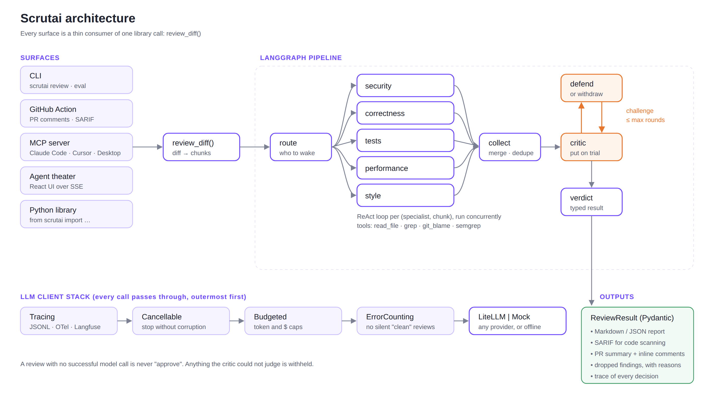
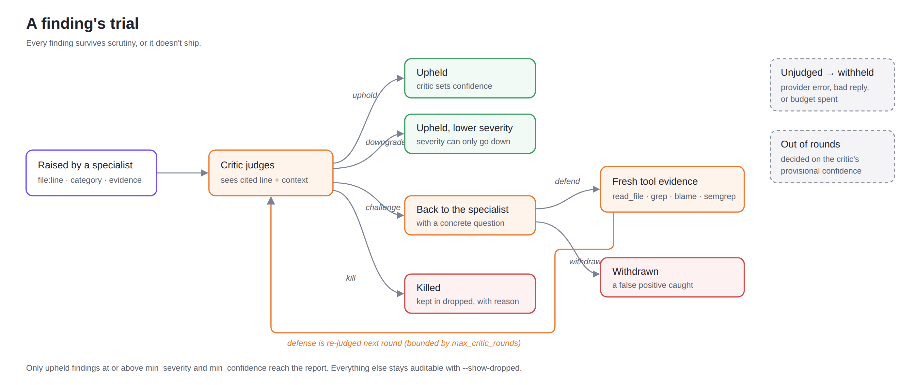

# Architecture & design rationale

This document explains *why* Scrutai is built the way it is. (The "why" is what an
interviewer probes, so it is kept honest and specific.)



## Library-first

`scrutai` the package is the engine. The CLI, the GitHub Action, and the (v0.3) web UI are all
thin consumers of `review_diff()`. Nothing about GitHub or a terminal leaks into the core. This is
what lets the same reviewed logic power several surfaces without duplication.

```
cli.py / action.yml / eval harness
            │
      review_diff()  ── orchestrator.py (LangGraph)
            │
  router.py · agents/* · critic.py
            │
  tools/ (read_file, grep, git_blame, semgrep) · llm.py (LiteLLM | mock)
```

## Why hierarchical delegation over a flat swarm

A single generalist prompt that "finds all the issues" degrades as scope grows and gives you no
control over cost or focus. A hierarchy (an orchestrator that routes to narrow specialists) means:
(1) each agent has a tight, testable remit; (2) the router can skip irrelevant specialists (a
CSS-only change never wakes the security agent), which is the main cost lever; (3) new specialists
are additive. Routing is heuristic first; an optional LLM router may only *narrow* that set, so a
confused router can save money but never widen the blast radius.

## Why the ReAct specialists use real tools

Reasoning over the diff *text* alone misses everything the diff doesn't show: the function being
called three files away, who last touched a line, whether a Semgrep rule fires. Each specialist runs
a bounded think → act → observe loop over `read_file`, `grep` (with a path glob), `git_blame` and
`semgrep`. Tool arguments come from a model, so paths are confined to the repo root, patterns are
passed as data (never as flags), and the Semgrep ruleset always comes from config, never from the
model. Semgrep hits on added lines are also *seeded* into the security agent's context before the
loop starts: a deterministic rule firing on the exact line is the strongest evidence a finding can
carry.

## Why an adversarial critic (self-reflection), and why a debate



LLM reviewers are noisy: they raise plausible-sounding issues that don't hold up. The critic is a
self-reflection loop that sees the cited line *and its surrounding code* (not just the specialist's
claim) and returns one of four decisions: **uphold**, **downgrade** (severity can only go down),
**kill**, or **challenge**. A challenge sends the finding back to the specialist that raised it,
which may gather fresh tool evidence and defend, or withdraw (withdrawing a false positive counts as a
success). The critic then re-judges only the contested findings.

Two rules keep the promise "every finding survives scrutiny, or it doesn't ship":

* A finding the critic **could not judge** (provider error, unparseable reply, budget exhausted) is
  *withheld* and marked `unjudged`. It is never passed through on the specialist's word.
* Killed and withheld findings are kept in `ReviewResult.dropped` with the reason, so the critic's
  work is auditable (`--show-dropped`) and measurable (the eval ablation).

### Why the loop terminates where it does

`max_critic_rounds` bounds the debate (default 2: judge, one defense, re-judge). A finding still
contested when rounds run out is decided on the critic's provisional confidence, so the loop can never
run away. `max_critic_rounds: 1` disables the debate entirely.

## Why chunked, concurrent fan-out

Running Scrutai on its own 4k-line branch diff showed the naive design (every specialist sees the
whole diff on every ReAct step) blowing its token budget, and long prompts dilute a model's attention
anyway. The diff is therefore packed into chunks of about `chunk_lines` added lines (oversized files
are sliced, keeping true line numbers), each chunk is routed on its own, and LangGraph's `Send` API
runs one branch per (specialist, chunk) concurrently. A reducer merges the branches; `collect`
sorts before deduplicating so results are identical regardless of completion order. Critic
judgements and defenses run on a small thread pool.

## Why a budget guardrail

Agent loops multiply calls. Every review runs through a `BudgetedClient` that refuses further calls
once `token_budget` or `max_cost_usd` is spent. The check precedes each call, so concurrent
overshoot is bounded by the number of in-flight calls. A budget hit produces a *partial* review that
says so, and anything it left unjudged is withheld rather than shipped.

## Why everything is a Pydantic object

Findings are typed from the moment a specialist emits them, with a machine-readable `category`. That
makes the critic able to reason over structured objects (not prose), makes dedup trivial, gives the
eval harness something exact to score, and makes the whole non-deterministic system unit-testable
against a scripted model.

## Why an eval harness ships with the tool

A reviewer you can't measure is a reviewer you can't trust. Each benchmark case runs in its own
temporary repo, so tool calls see a hermetic world. Findings are scored by category as a multiset per
case. The harness reports precision / recall / F1, false-discovery rate and **clean-case FPR**, and
computes the same metrics on everything the specialists raised *before* the critic: the **critic
lift**. The benchmark deliberately includes traps and cases labelled as expected misses so the
numbers can't quietly become flattering. CI runs it as a regression gate.

## The mock model, and what it does and doesn't prove

`mock.py` is a deterministic stand-in that speaks Scrutai's real prompt protocol (ReAct actions,
findings JSON, critic verdicts, defenses). Its specialists are intentionally noisy: they match rules
against raw lines, so sinks in comments and strings get flagged. Its critic is stricter, so the
pipeline can be tested end to end, offline, in CI. Benchmark numbers in mock mode validate the
*machinery*, not a model; `llm_mode: live` measures a real one.

The mock also taught a real lesson: Scrutai reviewing its own source saw the literal text
`--- FINAL` (a protocol marker) inside the diff. Protocol markers are now only recognised at line
start, and reviewed code is always prefixed with `L<n>:`, so diff content cannot spoof the protocol.

## The framework seam

Specialists share everything except one method: `Specialist._loop`, the ReAct loop that both
`review()` and the debate's `defend()` run. Prompts, tools, finding parsing and the critic are
common code. The CrewAI backend overrides only `_loop`: a CrewAI `Agent` + `Task` + `Crew` drives
the Thought / Action / Observation cycle, Scrutai's sandboxed tools are wrapped as CrewAI
`BaseTool`s, and the model is reached through `BridgeLLM`, a CrewAI `BaseLLM` that translates
CrewAI's text protocol to Scrutai's JSON protocol and calls Scrutai's own client.

Routing the model through the bridge (rather than letting CrewAI call a provider directly) is the
deliberate choice: budget caps, cost accounting, tracing and mock mode keep working, and a
native-vs-CrewAI comparison holds model and protocol constant, so `eval --compare` measures the
framework and nothing else. CrewAI's telemetry is disabled; a code reviewer must not send data
anywhere it wasn't told to.

## Observability and the agent theater

`--trace run.jsonl` records every node, LLM call (role, model, tokens, latency), tool call and critic
decision. Spans emit start and end events, every event carries the run id and a sequence number,
and point events record the run plan, each finding as raised, each decision and each defense. The
same spans go to OpenTelemetry (`tracing: otel`), and live LLM calls can be logged to Langfuse
through LiteLLM (`tracing: langfuse`).

`scrutai serve` streams those events to the browser over Server-Sent Events. The React UI derives
everything it draws from one pure `reduce(events)` function, so a live run, a replayed trace and a
scrubbed position render identically, and the UI is unit-tested against a real recorded trace.
Writing that reducer exposed two backend bugs: per-call token counts double-counting under
concurrency, and defenses being reported as withdrawals.
