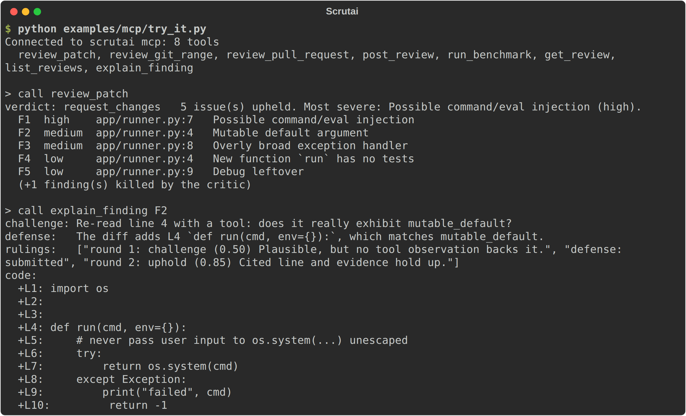

# Scrutai MCP server

`scrutai mcp` exposes Scrutai over the [Model Context Protocol](https://modelcontextprotocol.io),
so an MCP client (Claude Code, Claude Desktop, Cursor, your own agents) can ask for a review and
get Scrutai's critic-vetted findings back as structured data. The client can then explain the
findings, fix them, or post them to a pull request.

```text
MCP client ──(stdio, or Streamable HTTP + bearer token)──▶ scrutai mcp ──▶ review_diff()
```

The server is a thin adapter: every review runs through the same engine as the CLI, the GitHub
Action and the web UI, with the same config file, budgets and mock mode.

- [Install](#install)
- [Connect a client](#connect-a-client)
- [Tools](#tools)
- [Resources](#resources)
- [Prompts](#prompts)
- [Long reviews: progress, cancellation, `wait=false`](#long-reviews)
- [Security model](#security-model)
- [Command reference](#command-reference)
- [Troubleshooting](#troubleshooting)

## Install

```bash
pip install "scrutai[mcp] @ git+https://github.com/imkarthiknr/Scrutai.git"
scrutai mcp --help
```

Scrutai works with MCP Python SDK **1.28+ and 2.x**. The `crewai` extra pins the SDK to 1.28, so
if you install both, you get 1.28, which is fully supported.

Reviews use your `.scrutai.yml` (or `--config FILE`). The default is **mock mode**: the whole
pipeline runs offline, with no API key. Set `llm_mode: live` (and e.g. `ANTHROPIC_API_KEY`) for
real reviews.

To check that the server works before wiring up a client, run the scripted client:

```bash
python examples/mcp/try_it.py   # starts scrutai mcp over stdio, reviews a patch, explains a finding
```



## Connect a client

Ready-to-paste configs are in [`examples/mcp/`](../examples/mcp/).

### Claude Code

Local (stdio). Claude Code starts the server for you:

```bash
claude mcp add scrutai -- scrutai mcp --root "$PWD"
```

Remote (Streamable HTTP). Start the server where your code is:

```bash
export SCRUTAI_MCP_TOKEN="$(python -c 'import secrets; print(secrets.token_urlsafe(32))')"
scrutai mcp --transport http --port 8000 --root ~/src
```

Then connect to it:

```bash
claude mcp add --transport http scrutai http://127.0.0.1:8000/mcp \
  --header "Authorization: Bearer $SCRUTAI_MCP_TOKEN"
```

Then ask, for example: *"Review my branch against main with Scrutai"*, or run the
`/mcp__scrutai__review-my-branch` prompt.

### Claude Desktop and Cursor

Desktop clients start the server without your shell's `PATH` or working directory. Use absolute
paths for the `scrutai` executable (e.g. `/path/to/venv/bin/scrutai`), for `--root` and for
`--config`:

```json
{
  "mcpServers": {
    "scrutai": {
      "command": "/path/to/venv/bin/scrutai",
      "args": ["mcp", "--root", "/path/to/your/repo", "--config", "/path/to/your/repo/.scrutai.yml"]
    }
  }
}
```

Put this in `claude_desktop_config.json` (Claude Desktop) or `.cursor/mcp.json` (Cursor). For a
remote server, Cursor takes `{"url": "https://…/mcp", "headers": {"Authorization": "Bearer …"}}`.

## Tools

Every tool returns **structured content** (its output schema is published with the tool) plus the
same data as JSON text, for clients without structured-output support.

| Tool | What it does | Annotations |
|---|---|---|
| `review_patch` | Review a unified diff (`patch`); agents read other files of `repo` for context. | read-only, open-world |
| `review_git_range` | Review `base...head` (merge-base diff, like a PR) in `repo`. | read-only, open-world |
| `review_pull_request` | Fetch PR `pr` from GitHub (`repo_slug`, default: the origin remote) and review it. Never posts. | read-only, open-world |
| `post_review` | Post a finished PR review: one summary comment (edited in place later) plus inline comments for findings not yet posted. **Asks the user first.** Absent with `--no-post`. | **destructive**, idempotent |
| `get_review` | A review's status, and once done, its verdict and findings. | read-only |
| `list_reviews` | Reviews in this server process, newest first (`limit`, `offset`). | read-only |
| `explain_finding` | One finding (`F1`… or its fingerprint): full evidence, the critic's challenge, the specialist's defense, the ruling per round, and the reviewed code around the line. | read-only |
| `run_benchmark` | Precision and recall on the labelled benchmark, with and without the critic; `compare_backend="crewai"`; `limit`. Asks first in live mode. | read-only, open-world |

`repo` is a path inside an allowed root: absolute, or relative to the first `--root`. It defaults
to the first root.

A review returns a `ReviewSummary`:

```json
{
  "review_id": "81f0724510ed",
  "label": "main...HEAD",
  "status": "done",
  "error": null,
  "verdict": "request_changes",
  "summary": "5 issue(s) upheld. Most severe: Possible command/eval injection (high).",
  "findings": [
    {
      "id": "F1",
      "fingerprint": "f6b990ab0612847e",
      "agent": "security",
      "title": "Possible command/eval injection",
      "body": "Input reaches a dynamic execution sink (shell or eval/exec).",
      "file": "app/runner.py",
      "line": 7,
      "category": "injection",
      "severity": "high",
      "confidence": 0.85,
      "evidence": ["L7: return os.system(cmd)", "grep: 0 call site(s) of this sink in the repo"],
      "critic_note": "Cited line and evidence hold up.",
      "defended": false
    }
  ],
  "dropped": 1,
  "agents": ["security", "correctness", "tests", "style"],
  "files": 1,
  "partial": false,
  "budget_exhausted": false,
  "cancelled": false,
  "rounds": 2,
  "tokens_used": 9059,
  "cost_usd": 0.0
}
```

(This is the bundled demo in mock mode, with four of its five findings left out.)

### Posting to GitHub

Reviewing never writes anything. Only `post_review` does, and only:

- for a finished `review_pull_request` review that is not partial (not cancelled or over budget);
- if the pull request has no new commits since the review (otherwise: review it again);
- after the **user confirms**. The client shows a confirmation request (MCP elicitation). On mcp
  2 with protocol 2026-07-28, which has no server-to-client requests, the tool returns an
  *input-required* result and the client retries with the answer. Clients that cannot ask must
  pass `confirm=true`, which they should do only after the user has agreed. A client that can ask
  is always asked, and a "no" wins over `confirm=true`.

It uses the GitHub Action's publishing path, so posting twice edits the summary and skips
findings already posted. The GitHub token comes **only from the server's environment**
(`GITHUB_TOKEN`, plus `GITHUB_API_URL` for GitHub Enterprise). Start the server with `--no-post`
to remove the tool entirely.

## Resources

| URI | Content |
|---|---|
| `scrutai://reviews/{review_id}` | the full result as JSON, including the dropped findings |
| `scrutai://reviews/{review_id}/report.md` | the Markdown report the GitHub Action posts |
| `scrutai://reviews/{review_id}/sarif` | SARIF 2.1.0 |
| `scrutai://reviews/{review_id}/trace` | the JSONL trace; open it with `scrutai serve --replay FILE` |
| `scrutai://agents` | the specialists: role, categories, tools, whether enabled |
| `scrutai://config` | the effective config and server settings (secret-looking strings redacted) |

## Prompts

| Prompt | Arguments | Does |
|---|---|---|
| `review-my-branch` | `base`, `head`, `repo` (all optional) | review, list findings by severity, explain and fix the high ones |
| `fix-finding` | `review_id`, `finding_id` | embeds the finding and its code, then asks for a minimal fix, a test and a re-review |
| `security-audit` | `base`, `head`, `repo` | security findings only, judged for exploitability, plus what a diff review cannot see |

<a id="long-reviews"></a>
## Long reviews: progress, cancellation, `wait=false`

- **Progress.** If the client sends a progress token, reviews report steps such as
  `Routed 4 task(s) to security, correctness, …`, `security finished chunk 0 (1 raised)`,
  `Critic cross-examining findings` and finally `Verdict reached`. The benchmark reports per case.
- **Cancellation.** Cancelling the request stops the review at its next model call. The review
  ends as a **partial** result (`cancelled: true`) with nothing unjudged, and `get_review` still
  shows it.
- **`wait=false`.** Review tools return a `review_id` at once (`status: "running"`), and the
  client polls `get_review`. Use it for big diffs or for clients with short timeouts.
- **Limits.** At most `--max-concurrent` reviews run at once (default 2). Up to 5× that many may
  be queued; beyond that new reviews are refused with "server busy". Reviews are kept in memory
  (up to 50; the oldest finished ones are dropped first).

## Security model

A remote client controls every tool argument, so the server trusts none of them.

1. **Path allowlist.** `repo` must resolve, symlinks included, inside a `--root`. Git refs are
   validated, so `--output=…` or `a..b` are rejected before git sees them.
2. **Posting is separate and confirmed.** See [Posting to GitHub](#posting-to-github).
3. **Locked-down HTTP.**
   - Binds to `127.0.0.1` by default. Binding anywhere else **requires** `SCRUTAI_MCP_TOKEN`
     (16+ characters; read from the environment only, never a flag), and the server refuses to
     start without it.
   - With a token set, every request needs `Authorization: Bearer <token>`, compared in constant
     time; anything else gets `401`.
   - The `Host` header must match an allowed name (localhost forms, the bind address, and each
     `--allowed-host`); anything else gets `421`. This blocks DNS rebinding.
   - The server speaks plain HTTP. Off your machine, put it behind a TLS-terminating reverse
     proxy and add the proxy's name with `--allowed-host`.
4. **Untrusted code stays data.** Finding text quotes the reviewed code. Tool descriptions and
   prompts tell the client to treat it as data, and `fix-finding` embeds it as one line of JSON.
5. **Bounded inputs and outputs.** Patches up to 2 MB, diffs up to 300 files and 4 MB; evidence
   is truncated in summaries (full in `explain_finding`); lists are paged.
6. **Budgets on every call.** `token_budget` and `max_cost_usd` from your config apply to each
   review. A live benchmark run asks the user first.

## Command reference

```text
scrutai mcp [OPTIONS]

  --transport [stdio|http]  stdio (default; local clients launch the process) or http
  --host TEXT               HTTP: interface to bind (default 127.0.0.1)
  --port INTEGER            HTTP: port (default 8000); the endpoint is /mcp
  --root TEXT               directory tools may read; repeatable (default: the current one)
  --allowed-host TEXT       HTTP: extra Host header to accept (a proxy's name); repeatable
  --max-concurrent INTEGER  reviews allowed to run at once (default 2)
  --no-post                 do not offer post_review
  --benchmark TEXT          labelled cases for run_benchmark (default benchmark/cases.jsonl)
  --config TEXT             Scrutai config (default .scrutai.yml)

Environment:
  SCRUTAI_MCP_TOKEN   HTTP bearer token (required off localhost)
  GITHUB_TOKEN        for review_pull_request and post_review
  GITHUB_API_URL      GitHub Enterprise API URL (default https://api.github.com)
  ANTHROPIC_API_KEY…  whatever your live model needs (llm_mode: live)
```

## Troubleshooting

| Symptom | Fix |
|---|---|
| `Refusing to start: binding to 0.0.0.0 needs a bearer token` | Set `SCRUTAI_MCP_TOKEN` (16+ characters). |
| HTTP `421 unexpected Host header` | Add the name clients use to reach the server: `--allowed-host scrutai.example.com`. |
| HTTP `401` | The client must send `Authorization: Bearer $SCRUTAI_MCP_TOKEN`. |
| `repo … is outside the allowed roots` | Start the server with `--root` covering that path. |
| `a GitHub token is required (set GITHUB_TOKEN)` | Set `GITHUB_TOKEN` in the **server's** environment. |
| `This client cannot ask the user to confirm` | Your client doesn't support elicitation. Confirm in chat, then call the tool with `confirm=true`. |
| A desktop client can't find `scrutai` | Use the absolute path to the executable inside your virtualenv. |
| Every review looks the same and costs nothing | You are in mock mode; set `llm_mode: live`. |
